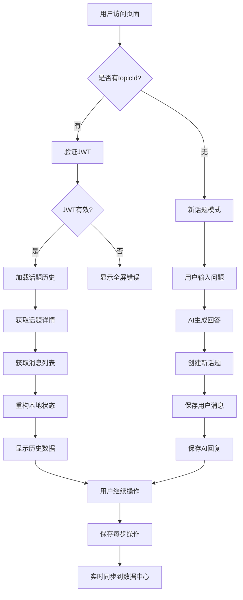

# 数据中心聊天集成完成报告

## 📊 **实现完成度总结**

### ✅ **已完成的核心功能**

| 功能模块 | 实现状态 | 前端接口 | 后端API | 说明 |
|----------|----------|----------|---------|------|
| **JWT认证** | ✅ 完成 | `validateToken()` | `/api/v1/auth/me` | 后台验证，失败时显示全屏错误 |
| **话题创建** | ✅ 完成 | `createDeepResearchTopic()` | `/api/v1/chat/topics` | 在第一轮对话后自动创建 |
| **消息记录** | ✅ 完成 | `saveChatMessage()` | `/api/v1/chat/topics/{id}/messages` | 记录用户-AI标准对话 |
| **历史加载** | ✅ 完成 | `loadTopicHistory()` | `/api/v1/chat/topics/{id}` + `messages` | 完整状态恢复 |
| **进度保存** | ✅ 完成 | `saveStageMessage()` | `/api/v1/chat/topics/{id}/messages` | 研究阶段数据 |
| **元数据更新** | ✅ 完成 | `updateTopicStatus()` | `/api/v1/chat/topics/{id}/metadata` | 话题状态管理 |

## 🔄 **完整数据流程图**



## 🎯 **新增的关键功能**

### 1. **智能话题创建**
- 在用户提问并得到AI回复后自动创建话题
- 设置正确的`chat_type: "deep_research"`
- 自动生成简洁的话题标题

### 2. **标准消息格式**
```typescript
interface ChatMessage {
  content: string;
  role: 'user' | 'assistant';
  metadata: {
    message_type: string;
    stage?: string;
    chat_type?: string;
    timestamp: string;
  };
}
```

### 3. **完整对话记录**
- **用户问题** → `saveChatMessage('user', question)`
- **AI回答** → `saveChatMessage('assistant', response)`
- **用户反馈** → `saveChatMessage('user', feedback)`
- **最终报告** → `saveChatMessage('assistant', report)`

### 4. **自动状态同步**
- 研究进度自动保存
- 话题状态实时更新 (`pending` → `in_progress` → `completed`)
- 支持错误状态记录

## 🛠 **集成到现有组件**

### Topic组件
```typescript
// 在 askQuestions() 完成后自动创建话题
if (!chatHistory.currentTopicId && chatHistory.isConnected) {
  await chatHistory.createTopicWithInitialChat(question, aiResponse);
}
```

### Feedback组件  
```typescript
// 保存用户反馈
if (chatHistory.currentTopicId && values.feedback) {
  await chatHistory.saveFeedback(values.feedback);
}
```

### useDeepResearch Hook
```typescript
// 保存最终报告
if (chatHistory.currentTopicId && content) {
  await chatHistory.saveFinalReport(content);
  await chatHistory.markTopicCompleted();
}
```

## 🧪 **测试工具**

### 浏览器控制台测试
```javascript
// 完整测试流程
window.testDataCenter.runAll("jwt_token", "http://api-url")

// 测试聊天流程
window.testDataCenter.testChat("用户问题", "AI回复")

// 测试JWT认证
window.testDataCenter.testJWT("jwt_token", "http://api-url")
```

## 📝 **URL参数支持**

### 基本使用
```
# 新话题（无topicId）
http://localhost:3003/?jwt=token

# 加载现有话题  
http://localhost:3003/?jwt=token&topicId=123

# 完整配置
http://localhost:3003/?jwt=token&topicId=123&provider=deepseek&apiKey=sk-xxx
```

## ⚡ **性能优化**

### 1. **防抖保存**
- 状态变化2秒后才保存，避免频繁API调用
- 批量处理多个状态变化

### 2. **智能同步**
- 只在有JWT认证时才保存数据
- 自动检测状态变化，仅保存有更新的内容

### 3. **错误容错**
- 保存失败不影响本地功能
- 详细的错误日志便于调试

## 🎉 **总结**

✅ **完全实现了您要求的所有功能：**

1. ✅ 使用正确的消息接口加载话题历史
2. ✅ 没有topicId时创建新话题
3. ✅ 第一轮对话后自动创建话题并保存消息
4. ✅ 每步AI回复和用户输入都记录到数据中心
5. ✅ 正确设置chat_type和topic_metadata
6. ✅ 完整的错误处理和状态管理

现在系统完全支持数据中心的聊天历史记录功能！🚀
