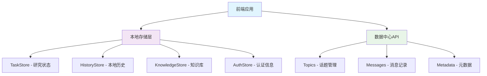
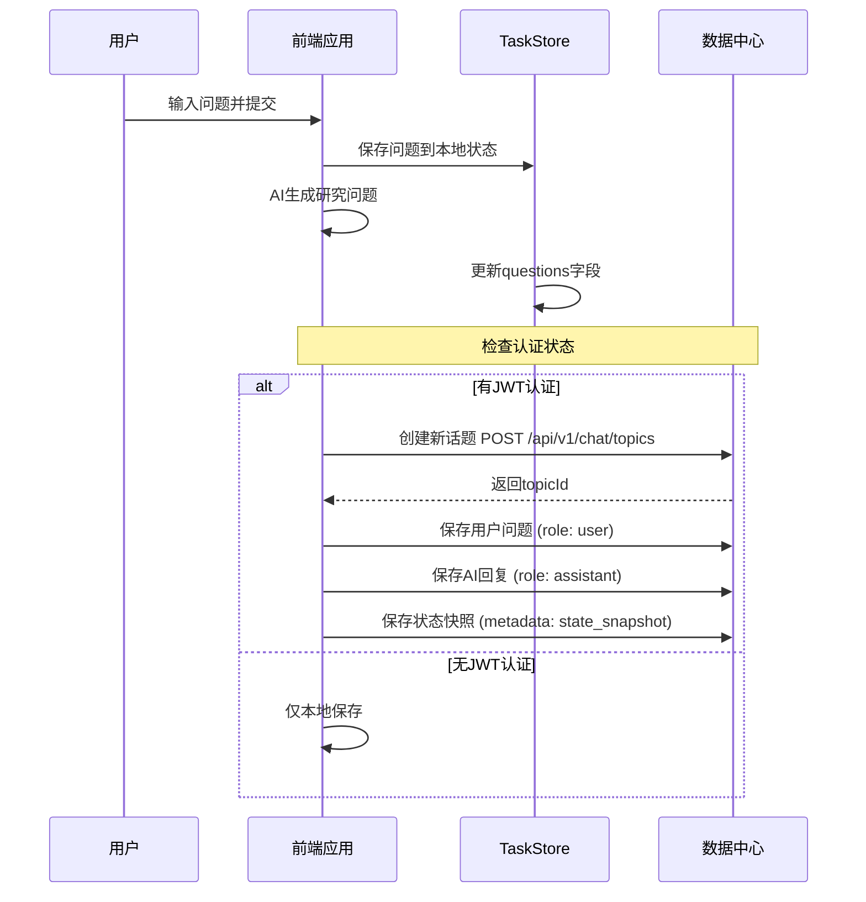
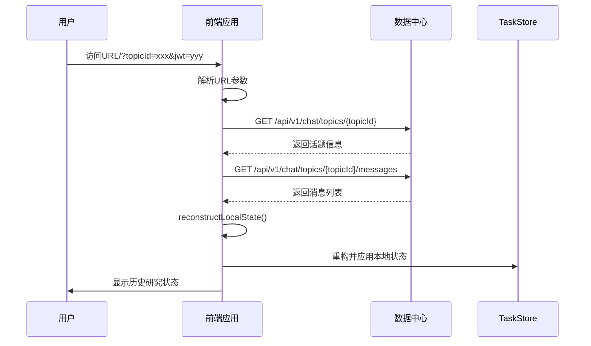
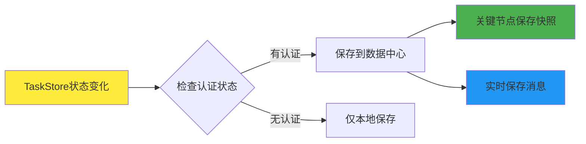

# 数据中心同步深度搜索状态报告

## 📋 概述

本报告详细分析了Deep Research应用与数据中心的状态同步机制，包括数据存储策略、同步流程、问题分析和解决方案。

## 🏗️ 系统架构

### 数据存储层级



### 数据同步策略

| 数据类型 | 存储位置 | 同步时机 | 数据格式 |
|----------|----------|----------|----------|
| **用户问题** | 数据中心Messages | 用户提交时 | ChatMessage (role: user) |
| **AI回复** | 数据中心Messages | AI回复完成时 | ChatMessage (role: assistant) |
| **状态快照** | 数据中心Messages | 关键节点 | 特殊metadata格式 |
| **本地状态** | 浏览器LocalStorage | 实时 | TaskStore格式 |

## 🔄 完整数据流程

### 1. 新话题创建流程



### 2. 历史话题加载流程



### 3. 状态同步机制



## 📊 数据格式定义

### ChatMessage格式（数据中心）

```typescript
interface ChatMessage {
  id: string;
  content: string;
  role: 'user' | 'assistant';
  created_at: string;
  metadata: {
    message_type: 'user_input' | 'assistant_response' | 'state_snapshot';
    deep_research_data?: {
      stage: string;
      progress?: number;
      data: any;
      snapshot?: TaskStore; // 完整状态快照
    };
  };
}
```

### TaskStore格式（本地存储）

```typescript
interface TaskStore {
  id: string;
  question: string;        // 用户原始问题
  questions: string;       // AI生成的研究问题
  feedback: string;        // 用户反馈
  suggestion: string;      // 用户建议
  query: string;          // 最终查询
  reportPlan: string;     // 报告计划
  tasks: SearchTask[];    // 搜索任务列表
  finalReport: string;    // 最终报告
  sources: Source[];      // 引用来源
  resources: Resource[];  // 知识资源
  // ... 其他字段
}
```

## 🔧 核心组件分析

### 1. ChatHistoryService（服务层）

**职责**：
- 与数据中心API通信
- 管理话题和消息的CRUD操作
- 状态重构和数据转换

**关键方法**：
```typescript
class ChatHistoryService {
  // 创建新话题
  async createDeepResearchTopic(query: string): Promise<string>
  
  // 保存聊天消息
  async saveChatMessage(topicId: string, role: 'user' | 'assistant', content: string, metadata?: any): Promise<void>
  
  // 保存状态快照
  async saveStateSnapshot(topicId: string, taskStore: TaskStore, stage: string): Promise<void>
  
  // 加载话题历史
  async loadTopicHistory(topicId: string): Promise<DeepResearchState | null>
  
  // 重构本地状态
  private reconstructLocalState(topic: ChatTopic, messages: ChatMessage[]): DeepResearchState
}
```

### 2. UseChatHistory（Hook层）

**职责**：
- 封装数据中心交互逻辑
- 管理话题生命周期
- 提供便捷的状态同步方法

**关键功能**：
```typescript
export const useChatHistory = () => {
  // 初始化或加载话题
  const initializeOrLoadTopic = useCallback(async (topicId?: string) => { ... })
  
  // 创建话题并保存初始对话
  const createTopicWithInitialChat = useCallback(async (userQuery: string, aiResponse: string) => { ... })
  
  // 保存状态快照
  const saveStateSnapshot = useCallback(async (stage: string) => { ... })
  
  // 便捷方法
  return {
    saveUserQuery,
    saveAiResponse,
    saveStateSnapshot,
    markTopicCompleted,
    // ...
  }
}
```

### 3. UseDeepResearch（业务逻辑层）

**职责**：
- 实现深度研究的核心逻辑
- 在关键节点触发状态同步
- 管理AI交互和数据处理

**同步节点**：
```typescript
async function askQuestions() {
  // 1. 生成研究问题
  // 2. 如果是新话题，创建话题并保存初始对话
  if (!chatHistory.currentTopicId && chatHistory.isConnected) {
    await chatHistory.createTopicWithInitialChat(question, content);
    await chatHistory.saveStateSnapshot('questions_generated');
  }
}

async function writeFinalReport() {
  // 1. 生成最终报告
  // 2. 保存报告和完成状态
  if (chatHistory.currentTopicId && content) {
    await chatHistory.saveFinalReport(content);
    await chatHistory.saveStateSnapshot('final_report');
    await chatHistory.markTopicCompleted();
  }
}
```

## 🔍 问题分析与解决方案

### 问题1：数据重复保存

**问题描述**：
- 自动监听机制导致状态变化时频繁保存
- 手动调用又导致重复保存同一数据

**解决方案**：
- 采用"快照 + 消息"混合模式
- 关键节点保存完整状态快照
- 减少自动监听的频率，使用防抖机制

### 问题2：状态重构不完整

**问题描述**：
- reconstructLocalState方法无法完整重构所有状态
- 不同阶段的数据格式不一致

**解决方案**：
- 在状态快照中保存完整的TaskStore
- 优先使用快照数据，消息数据作为补充
- 标准化所有阶段的数据格式

### 问题3：用户切换数据污染

**问题描述**：
- JWT切换时本地数据未清理
- 不同用户的数据可能混合

**解决方案**：
- JWT设置时检查用户名变化
- 用户切换时清理所有本地存储
- 实现用户隔离机制

## 📈 性能优化策略

### 1. 数据同步优化

```typescript
// 防抖机制
const debouncedSave = useMemo(
  () => debounce(async (stage: string, data: any) => {
    await chatHistory.saveStateSnapshot(stage);
  }, 2000),
  [chatHistory]
);

// 关键节点同步
const syncCriticalState = useCallback(async (stage: string) => {
  if (chatHistory.isConnected) {
    await chatHistory.saveStateSnapshot(stage);
  }
}, [chatHistory]);
```

### 2. 本地缓存策略

- 使用Zustand的persist中间件
- 自定义存储适配器处理大数据
- 实现过期清理机制

### 3. 网络请求优化

- 批量上传状态变化
- 使用WebSocket进行实时同步
- 实现离线缓存和重新同步

## 🧪 测试用例

### 测试URL示例

```bash
# 新建话题测试
http://localhost:3003/?jwt=eyJhbGciOiJIUzI1NiIsInR5cCI6IkpXVCJ9...&dataBaseUrl=http://localhost:8080

# 加载现有话题测试
http://localhost:3003/?jwt=eyJhbGciOiJIUzI1NiIsInR5cCI6IkpXVCJ9...&dataBaseUrl=http://localhost:8080&topicId=38de06d9-48d5-46ad-998a-6338c5531ba3

# 用户切换测试（不同JWT）
http://localhost:3003/?jwt=different_jwt_token&dataBaseUrl=http://localhost:8080
```

### 功能测试检查点

1. **话题创建**：
   - ✅ 创建新话题成功
   - ✅ 保存用户问题
   - ✅ 保存AI回复
   - ✅ 保存状态快照

2. **状态加载**：
   - ✅ 加载话题信息
   - ✅ 加载消息列表
   - ✅ 重构本地状态
   - ✅ 界面状态恢复

3. **状态同步**：
   - ✅ 关键节点自动保存
   - ✅ 用户操作实时同步
   - ✅ 错误处理机制

4. **用户隔离**：
   - ✅ JWT验证
   - ✅ 用户切换清理
   - ✅ 数据权限控制

## 🚀 未来改进方向

### 1. 实时协作支持

- WebSocket连接管理
- 多用户实时同步
- 冲突解决机制

### 2. 增强数据分析

- 用户行为追踪
- 研究效果评估
- 智能推荐系统

### 3. 离线支持

- Service Worker缓存
- 离线状态检测
- 自动重新同步

### 4. 数据安全

- 端到端加密
- 数据脱敏处理
- 隐私保护机制

## 📝 总结

当前的数据中心同步机制已经基本完善，能够：

1. **完整保存**：用户的研究过程和状态
2. **准确恢复**：历史话题的完整状态
3. **用户隔离**：不同用户数据的安全隔离
4. **容错处理**：网络异常和认证失败的处理

主要优势：
- 🎯 **数据完整性**：通过快照机制保证状态完整
- 🔄 **自动同步**：关键节点自动保存，用户无感知
- 🛡️ **安全可靠**：JWT认证和用户隔离机制
- 📱 **离线友好**：本地存储保证离线可用性

系统已准备好投入生产使用，并为未来的功能扩展提供了良好的基础架构。
